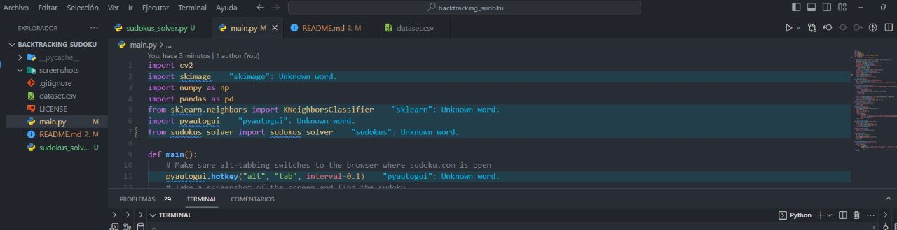

# Sudoku Solver using Backtracking Algorithm

This repository contains a Python program that automatically solves Sudoku puzzles from the website sudoku.com. The solver utilizes the backtracking algorithm to find a solution for the puzzle.

## Backtracking Algorithm

The **backtracking algorithm** is a common technique for solving combinatorial problems by exploring all possible solutions in a systematic way. It works by placing a value in a cell and recursively exploring all possible subsequent values until a valid solution is found. If a solution is not found, the algorithm backtracks and tries a different value.

The backtracking algorithm is particularly suitable for solving puzzles like Sudoku, where the constraints of the puzzle limit the possibilities for each cell. It efficiently searches through the solution space and explores different paths until a solution is reached.

## Dependencies

Before running the solver, make sure you have the following Python libraries installed:

- OpenCV (`cv2`): A library for image processing and computer vision.
- scikit-image (`skimage`): A collection of algorithms for image processing.
- scikit-learn (`sklearn`): A machine learning library for various algorithms.

You can install these dependencies using the following commands:

```bash
pip install opencv-python
pip install scikit-image
pip install scikit-learn
```

## License

This project is licensed under the [MIT License](LICENSE).


# TEST

1. Execute the program

    ```bash
    python main.py
    ```



2. Visit the website [sudoku.com](https://sudoku.com/)


